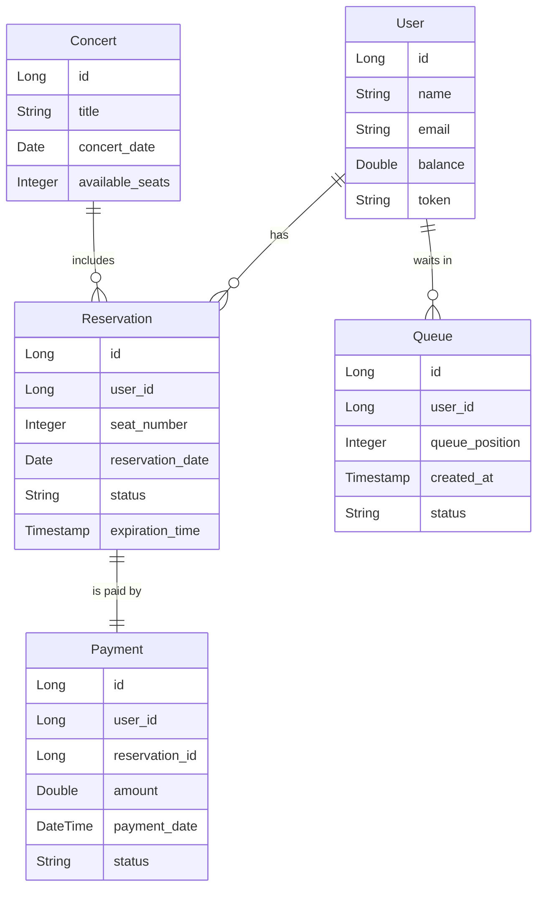

# 콘서트 예약 서비스

## 목차
1. [프로젝트 개요](#프로젝트-개요)
2. [프로젝트 목표 및 Milestone](#프로젝트-목표-및-milestone)
    - [1주차: 요구사항 분석 및 기본 기능 구현](#1주차-요구사항-분석-및-기본-기능-구현)
    - [2주차: 좌석 예약 및 대기열 시스템 구현](#2주차-좌석-예약-및-대기열-시스템-구현)
    - [3주차: 결제 시스템 구현 및 최종 통합 테스트](#3주차-결제-시스템-구현-및-최종-통합-테스트)
3. [시퀀스 다이어그램](#시퀀스-다이어그램)
4. [플로우 차트](#플로우-차트)
5. [ERD 설계](#erd-설계)
    - [ERD 다이어그램](#erd-다이어그램)
6. [API 명세](#api-명세)
    - [1. 유저 토큰 발급 API](#1-유저-토큰-발급-api)
    - [2. 예약 가능 날짜 조회 API](#2-예약-가능-날짜-조회-api)
    - [3. 특정 날짜의 좌석 조회 API](#3-특정-날짜의-좌석-조회-api)
    - [4. 좌석 예약 요청 API](#4-좌석-예약-요청-api)
    - [5. 잔액 충전 API](#5-잔액-충전-api)
    - [6. 잔액 조회 API](#6-잔액-조회-api)
    - [7. 결제 API](#7-결제-api)
7. [기술 스택 및 기본 패키지 구조](#기술-스택-및-기본-패키지-구조)

---

목차는 이렇게 각 섹션에 링크를 추가하여 작성하면 사용자가 쉽게 해당 항목으로 이동할 수 있습니다. 이를 통해 가독성을 높일 수 있습니다.

## 프로젝트 개요
**콘서트 예약 서비스**는 유저가 대기열을 통해 좌석을 예약하고 결제를 완료하는 시스템입니다. 사용자는 잔액을 충전하여 좌석을 예약하고, 대기열 시스템을 통해 예약 요청을 처리할 수 있습니다.

---

## 프로젝트 목표 및 Milestone

### 프로젝트 목표
- TDD와 클린 아키텍처를 적용한 콘서트 예약 서비스 개발.
- 유저 대기열 시스템 및 좌석 예약/결제 기능 구현.
- 동시성 문제를 고려한 안전한 예약 시스템 구축.

### Milestone (3주간 진행)

#### 1주차: 요구사항 분석 및 기본 기능 구현
- 시스템 요구사항 분석 및 클린 아키텍처 설계.
- ERD 설계 및 유저 토큰 발급, 잔액 충전/조회 API 구현.
- 유닛 테스트 작성.

#### 2주차: 좌석 예약 및 대기열 시스템 구현
- 예약 가능 날짜/좌석 조회 API 구현.
- 좌석 예약 요청 API 구현 및 대기열 시스템 구축.
- 통합 테스트 작성.

#### 3주차: 결제 시스템 구현 및 최종 통합 테스트
- 결제 API 구현.
- 좌석 예약 및 결제 통합 테스트.
- 최종 프로젝트 배포.

---
      
## 시퀀스 다이어그램

### 1. 유저 토큰 발급 시퀀스 다이어그램


### 2. 좌석 예약 요청 시퀀스 다이어그램


### 3. 결제 처리 시퀀스 다이어그램


---

## 플로우 차트

### 1. 대기열 관리 플로우 차트


### 2. 좌석 예약 및 결제 플로우 차트


### 3. 잔액 충전 플로우 차트


---

## ERD 설계

### 1. **User (유저)**

| Column        | Type    | Description                  |
|---------------|---------|------------------------------|
| id            | Long    | Primary Key, 유저 ID          |
| name          | String  | 유저 이름                     |
| email         | String  | 유저 이메일                   |
| balance       | Double  | 유저 잔액                     |
| token         | String  | 대기열 토큰                   |

### 2. **Reservation (좌석 예약)**

| Column         | Type     | Description                           |
|----------------|----------|---------------------------------------|
| id             | Long     | Primary Key, 예약 ID                   |
| user_id        | Long     | 유저 ID (Foreign Key)                 |
| seat_number    | Integer  | 좌석 번호 (1~50)                     |
| reservation_date | Date   | 예약 날짜                             |
| status         | String   | 예약 상태 (예: 'reserved', 'pending') |
| expiration_time | Timestamp| 예약 만료 시간                        |

### 3. **Payment (결제)**

| Column        | Type     | Description                        |
|---------------|----------|------------------------------------|
| id            | Long     | Primary Key, 결제 ID                |
| user_id       | Long     | 유저 ID (Foreign Key)              |
| reservation_id| Long     | 예약 ID (Foreign Key)              |
| amount        | Double   | 결제 금액                          |
| payment_date  | DateTime | 결제 날짜                          |
| status        | String   | 결제 상태 (예: 'completed', 'failed') |

### 4. **Queue (대기열)**

| Column         | Type     | Description                           |
|----------------|----------|---------------------------------------|
| id             | Long     | Primary Key, 대기열 ID                 |
| user_id        | Long     | 유저 ID (Foreign Key)                 |
| queue_position | Integer  | 대기열 순서                           |
| created_at     | Timestamp| 대기열 생성 시간                      |
| status         | String   | 대기열 상태 (예: 'waiting', 'completed') |


### 5. **Concert (콘서트 정보)**

| Column         | Type     | Description                           |
|----------------|----------|---------------------------------------|
| id             | Long     | Primary Key, 콘서트 ID                 |
| title          | String   | 콘서트 제목                           |
| concert_date   | Date     | 콘서트 날짜                           |
| available_seats| Integer  | 콘서트 남은 좌석 수                    |

---

## ERD 다이어그램




---

## API 명세

### API SWAGGER
- 링크 : http://localhost:8080/concert-reservation-swagger/  (로컬 환경에서 확인 가능)

### 캡쳐본 1


### 캡쳐본 2


### API 명세 및 Mock API 작성

#### **1. 유저 토큰 발급 API**
- **Endpoint**: `POST /api/users/token`
- **Request**:
    - 없음
- **Response**:
  ```json
  {
    "token": "unique-user-token",
    "queuePosition": 1,
    "estimatedWaitTime": 300
  }
  ```
- **Description**: 사용자가 대기열에 진입하여 토큰을 발급받는 API. 토큰은 유저의 대기 순서와 예상 대기 시간을 포함.
- **Error**:
- `500 Internal Server Error`: `대기열 시스템 오류`
- **Authorization**: 없음(초기 토큰 발급이므로 필요없음)

---

#### **2. 예약 가능 날짜 조회 API**
- **Endpoint**: `GET /api/reservations/dates`
- **Request**:
    - 없음
- **Response**:
  ```json
  {
    "availableDates": ["2024-10-12", "2024-10-13", "2024-10-14"]
  }
  ```
- **Description**: 예약 가능한 날짜 목록을 반환.
- **Error**:
- `500 Internal Server Error`: `예약 가능한 날짜를 가져올 수 없어요~`
- **Authorization**: 없음

---

#### **3. 특정 날짜의 좌석 조회 API**
- **Endpoint**: `GET /api/reservations/seats`
- **Request**:
  ```json
  {
    "date": "2024-10-12"
  }
  ```
- **Response**:
  ```json
  {
    "date": "2024-10-12",
    "availableSeats": [1, 2, 3, 4, 5]
  }
  ```
- **Description**: 특정 날짜에 예약 가능한 좌석 정보를 반환.
- - **Error**:
- `400 Bad Request`: `날짜 정보가 없거나 불가능해요.`
- `500 Internal Server Error`: `좌석 정보를 가져올 수 없어요.`
- **Authorization**: `Bearer {token}` (발급된 토큰이 필요)
---

#### **4. 좌석 예약 요청 API**
- **Endpoint**: `POST /api/reservations`
- **Request**:
  ```json
  {
    "userToken": "unique-user-token",
    "seatNumber": 3,
    "reservationDate": "2024-10-12"
  }
  ```
- **Response**:
  ```json
  {
    "reservationId": 123,
    "status": "RESERVED",
    "expirationTime": "2024-10-12T10:15:00"
  }
  ```
- **Description**: 사용자가 좌석을 예약하고, 일정 시간 동안 임시로 해당 좌석을 예약 상태로 유지하는 API.
- **Error**:
    - `400 Bad Request`: `잘못된 좌석 번호이거나 날짜가 입력되었어요.`
    - `401 Unauthorized`: `잘못되거나 만료된 유저 토큰이에요.`
    - `409 Conflict`: `이선좌... 이미 예약된 좌석이에요.`
    - `500 Internal Server Error`: `예약 시스템이 아파요.`
- **Authorization**: `Bearer {token}`
---

#### **5. 잔액 충전 API**
- **Endpoint**: `POST /api/users/charge`
- **Request**:
  ```json
  {
    "userToken": "unique-user-token",
    "amount": 50000
  }
  ```
- **Response**:
  ```json
  {
    "status": "SUCCESS",
    "currentBalance": 100000
  }
  ```
- **Description**: 사용자의 잔액을 충전하는 API.
- **Error**:
    - `400 Bad Request`: `불가능한 양이에요.`
    - `401 Unauthorized`: `잘못되거나 만료된 유저 토큰이에요.`
    - `500 Internal Server Error`: `충전 시스템이 아파요.`
- **Authorization**: `Bearer {token}`
---

#### **6. 잔액 조회 API**
- **Endpoint**: `GET /api/users/balance`
- **Request**:
  ```json
  {
    "userToken": "unique-user-token"
  }
  ```
- **Response**:
  ```json
  {
    "currentBalance": 100000
  }
  ```
- **Description**: 사용자의 현재 잔액을 조회하는 API.
- **Error**:
    - `401 Unauthorized`: `잘못되거나 만료된 유저 토큰이에요.`
    - `500 Internal Server Error`: `잔액을 가져오는데 실패했어요.`
- **Authorization**: `Bearer {token}`
---

#### **7. 결제 API**
- **Endpoint**: `POST /api/payments`
- **Request**:
  ```json
  {
    "userToken": "unique-user-token",
    "reservationId": 123,
    "paymentAmount": 50000
  }
  ```
- **Response**:
  ```json
  {
    "status": "COMPLETED",
    "paymentId": 789
  }
  ```
- **Description**: 예약된 좌석에 대해 결제를 처리하는 API.
- **Error**:
    - `400 Bad Request`: `잘못된 결제 정보에요.`
    - `401 Unauthorized`: `잘못되거나 만료된 유저 토큰이에요.`
    - `409 Conflict`: `에엥 돈을 더 내시려고요? 이미 결제되었어요~!`
    - `500 Internal Server Error`: `결제 시스템이 아파요.`
- **Authorization**: `Bearer {token}`
---

### 기술 스택 및 기본 패키지 구조
**기술 스택**
- **Backend**: Kotlin, Spring Boot
- **Database**: PostgreSQL
- **ORM**: JPA (Hibernate)
- **In-memory DB (for testing)**: H2
- **API Documentation**: SpringDoc OpenAPI
- **Testing**: JUnit5, AssertJ
- **Dependency Management**: Gradle

---

**기본 패키지 구조**
```plaintext
/src
  /interfaces (Presentation 계층)
    /api
      /user
        UserController.kt  // 유저 토큰 발급 및 잔액 조회/충전 API
      /reservation
        ReservationController.kt  // 좌석 예약 요청 및 좌석/날짜 조회 API
      /payment
        PaymentController.kt  // 결제 API
    /dto
      TokenResponse.kt  // 유저 토큰 관련 DTO
      SeatAvailabilityResponse.kt  // 좌석 조회 관련 DTO
      ReservationRequest.kt  // 좌석 예약 요청 DTO
      ChargeRequest.kt  // 잔액 충전 요청 DTO
      PaymentRequest.kt  // 결제 요청 DTO
  /application (Application 계층)
    /user
      UserFacade.kt  // 유저 관련 비즈니스 로직 조합
    /reservation
      ReservationFacade.kt  // 예약 관련 비즈니스 로직 조합
    /payment
      PaymentFacade.kt  // 결제 관련 비즈니스 로직 조합
  /domain (Domain 계층)
    /user
      User.kt  // 유저 도메인 모델
      UserService.kt  // 유저 비즈니스 로직 처리
    /reservation
      Reservation.kt  // 예약 도메인 모델
      Seat.kt  // 좌석 도메인 모델
      ReservationService.kt  // 예약 비즈니스 로직 처리
    /payment
      Payment.kt  // 결제 도메인 모델
      PaymentService.kt  // 결제 비즈니스 로직 처리
  /infrastructure (Persistence 계층)
    /user
      UserRepositoryJpaImpl.kt  // 유저 리포지토리 JPA 구현체
    /reservation
      ReservationRepositoryJpaImpl.kt  // 예약 리포지토리 JPA 구현체
      SeatRepositoryJpaImpl.kt  // 좌석 리포지토리 JPA 구현체
    /payment
      PaymentRepositoryJpaImpl.kt  // 결제 리포지토리 JPA 구현체
```

---


