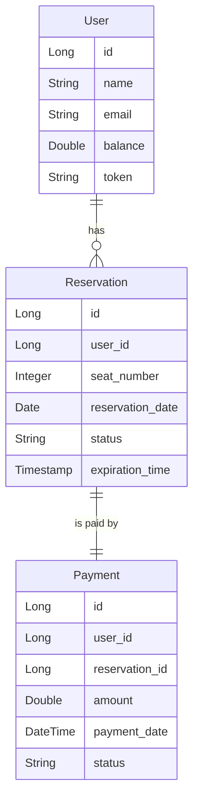

# 콘서트 예약 서비스

## 프로젝트 개요
**콘서트 예약 서비스**는 유저가 대기열을 통해 좌석을 예약하고 결제를 완료하는 시스템입니다. 사용자는 잔액을 충전하여 좌석을 예약하고, 대기열 시스템을 통해 예약 요청을 처리할 수 있습니다.

---

## 프로젝트 목표 및 Milestone

### 프로젝트 목표
- TDD와 클린 아키텍처를 적용한 콘서트 예약 서비스 개발.
- 유저 대기열 시스템 및 좌석 예약/결제 기능 구현.
- 동시성 문제를 고려한 안전한 예약 시스템 구축.

### Milestone (3주간 진행)

#### 1주차: 요구사항 분석 및 기본 기능 구현
- 시스템 요구사항 분석 및 클린 아키텍처 설계.
- ERD 설계 및 유저 토큰 발급, 잔액 충전/조회 API 구현.
- 유닛 테스트 작성.

#### 2주차: 좌석 예약 및 대기열 시스템 구현
- 예약 가능 날짜/좌석 조회 API 구현.
- 좌석 예약 요청 API 구현 및 대기열 시스템 구축.
- 통합 테스트 작성.

#### 3주차: 결제 시스템 구현 및 최종 통합 테스트
- 결제 API 구현.
- 좌석 예약 및 결제 통합 테스트.
- 최종 프로젝트 배포.

---

## 시스템 구조

### 아키텍처
프로젝트는 **클린 + 레이어드 아키텍처**로 설계되었습니다. 각 기능별로 명확한 책임을 갖고 도메인 모델과 서비스 레이어, 데이터베이스 레이어가 분리되어 있습니다.

```plaintext
/src
  /interfaces (Presentation 계층)
    /api
      /user
        UserController.kt  // 유저 토큰 발급 및 잔액 조회/충전 API
      /reservation
        ReservationController.kt  // 좌석 예약 요청 및 좌석/날짜 조회 API
      /payment
        PaymentController.kt  // 결제 API
    /dto
      TokenResponse.kt  // 유저 토큰 관련 DTO
      SeatAvailabilityResponse.kt  // 좌석 조회 관련 DTO
      ReservationRequest.kt  // 좌석 예약 요청 DTO
      ChargeRequest.kt  // 잔액 충전 요청 DTO
      PaymentRequest.kt  // 결제 요청 DTO
  /application (Application 계층)
    /user
      UserFacade.kt  // 유저 관련 비즈니스 로직 조합
    /reservation
      ReservationFacade.kt  // 예약 관련 비즈니스 로직 조합
    /payment
      PaymentFacade.kt  // 결제 관련 비즈니스 로직 조합
  /domain (Domain 계층)
    /user
      User.kt  // 유저 도메인 모델
      UserService.kt  // 유저 비즈니스 로직 처리
    /reservation
      Reservation.kt  // 예약 도메인 모델
      Seat.kt  // 좌석 도메인 모델
      ReservationService.kt  // 예약 비즈니스 로직 처리
    /payment
      Payment.kt  // 결제 도메인 모델
      PaymentService.kt  // 결제 비즈니스 로직 처리
  /infrastructure (Persistence 계층)
    /user
      UserRepositoryJpaImpl.kt  // 유저 리포지토리 JPA 구현체
    /reservation
      ReservationRepositoryJpaImpl.kt  // 예약 리포지토리 JPA 구현체
      SeatRepositoryJpaImpl.kt  // 좌석 리포지토리 JPA 구현체
    /payment
      PaymentRepositoryJpaImpl.kt  // 결제 리포지토리 JPA 구현체
```
      
## 시퀀스 다이어그램

### 1. 유저 토큰 발급 시퀀스 다이어그램


### 2. 좌석 예약 요청 시퀀스 다이어그램


### 3. 결제 처리 시퀀스 다이어그램


---

## 플로우 차트

### 1. 대기열 관리 플로우 차트


### 2. 좌석 예약 및 결제 플로우 차트


### 3. 잔액 충전 플로우 차트


---

## ERD 설계

### 1. **User (유저)**

| Column        | Type    | Description                  |
|---------------|---------|------------------------------|
| id            | Long    | Primary Key, 유저 ID          |
| name          | String  | 유저 이름                     |
| email         | String  | 유저 이메일                   |
| balance       | Double  | 유저 잔액                     |
| token         | String  | 대기열 토큰                   |

### 2. **Reservation (좌석 예약)**

| Column         | Type     | Description                           |
|----------------|----------|---------------------------------------|
| id             | Long     | Primary Key, 예약 ID                   |
| user_id        | Long     | 유저 ID (Foreign Key)                 |
| seat_number    | Integer  | 좌석 번호 (1~50)                     |
| reservation_date | Date   | 예약 날짜                             |
| status         | String   | 예약 상태 (예: 'reserved', 'pending') |
| expiration_time | Timestamp| 예약 만료 시간                        |

### 3. **Payment (결제)**

| Column        | Type     | Description                        |
|---------------|----------|------------------------------------|
| id            | Long     | Primary Key, 결제 ID                |
| user_id       | Long     | 유저 ID (Foreign Key)              |
| reservation_id| Long     | 예약 ID (Foreign Key)              |
| amount        | Double   | 결제 금액                          |
| payment_date  | DateTime | 결제 날짜                          |
| status        | String   | 결제 상태 (예: 'completed', 'failed') |

---

## ERD 다이어그램

