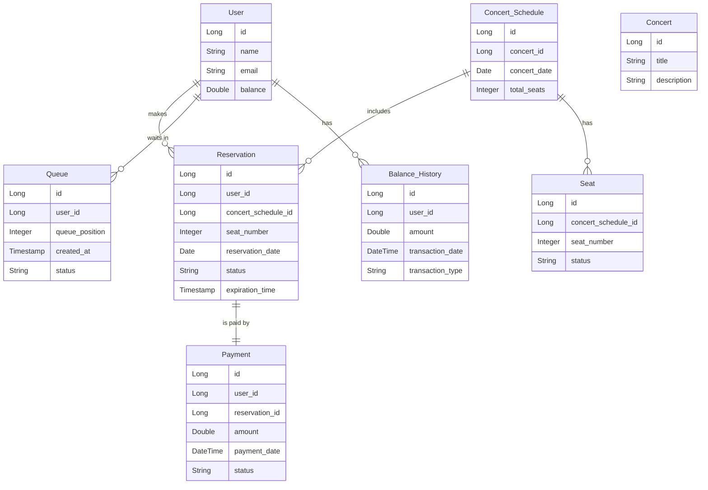

# 콘서트 예약 서비스

## 목차
1. [프로젝트 개요](#프로젝트-개요)
2. [프로젝트 목표 및 Milestone](#프로젝트-목표-및-milestone)
    - [1주차: 요구사항 분석 및 기본 기능 구현](#1주차-요구사항-분석-및-기본-기능-구현)
    - [2주차: 좌석 예약 및 대기열 시스템 구현](#2주차-좌석-예약-및-대기열-시스템-구현)
    - [3주차: 결제 시스템 구현 및 최종 통합 테스트](#3주차-결제-시스템-구현-및-최종-통합-테스트)
3. [시퀀스 다이어그램](#시퀀스-다이어그램)
4. [플로우 차트](#플로우-차트)
5. [ERD 설계](#erd-설계)
    - [ERD 다이어그램](#erd-다이어그램)
6. [API 명세](#api-명세)
    - [1. 유저 토큰 발급 API](#1-유저-토큰-발급-api)
    - [2. 예약 가능 날짜 조회 API](#2-예약-가능-날짜-조회-api)
    - [3. 특정 날짜의 좌석 조회 API](#3-특정-날짜의-좌석-조회-api)
    - [4. 좌석 예약 요청 API](#4-좌석-예약-요청-api)
    - [5. 잔액 충전 API](#5-잔액-충전-api)
    - [6. 잔액 조회 API](#6-잔액-조회-api)
    - [7. 결제 API](#7-결제-api)
7. [기술 스택 및 기본 패키지 구조](#기술-스택-및-기본-패키지-구조)
8. [동시성 이슈와 해결책](#동시성-이슈와-해결책) 
9. [조회 성능 개선과 캐싱 전략](#조회-성능-개선과-캐싱-전략)
---

## 프로젝트 개요
**콘서트 예약 서비스**는 유저가 대기열을 통해 좌석을 예약하고 결제를 완료하는 시스템입니다. 사용자는 잔액을 충전하여 좌석을 예약하고, 대기열 시스템을 통해 예약 요청을 처리할 수 있습니다.

---

## 프로젝트 목표 및 Milestone

### 프로젝트 목표
- TDD와 클린 아키텍처를 적용한 콘서트 예약 서비스 개발.
- 유저 대기열 시스템 및 좌석 예약/결제 기능 구현.
- 동시성 문제를 고려한 안전한 예약 시스템 구축.

### Milestone (3주간 진행)

#### 1주차: 요구사항 분석 및 기본 기능 구현
- 시스템 요구사항 분석 및 클린 아키텍처 설계.
- ERD 설계 및 유저 토큰 발급, 잔액 충전/조회 API 구현.
- 유닛 테스트 작성.

#### 2주차: 좌석 예약 및 대기열 시스템 구현
- 예약 가능 날짜/좌석 조회 API 구현.
- 좌석 예약 요청 API 구현 및 대기열 시스템 구축.
- 통합 테스트 작성.

#### 3주차: 결제 시스템 구현 및 최종 통합 테스트
- 결제 API 구현.
- 좌석 예약 및 결제 통합 테스트.
- 최종 프로젝트 배포.

---
      
## 시퀀스 다이어그램

### 1. 유저 토큰 발급 시퀀스 다이어그램


### 2. 좌석 예약 요청 시퀀스 다이어그램


### 3. 결제 처리 시퀀스 다이어그램


---

## 플로우 차트

### 1. 대기열 관리 플로우 차트


### 2. 좌석 예약 및 결제 플로우 차트


### 3. 잔액 충전 플로우 차트


---

## ERD 설계

## ERD 다이어그램


### 테이블 설명

1. **User (유저)**
    - `id`: Primary Key, 유저 ID
    - `name`: 유저 이름
    - `email`: 유저 이메일
    - `balance`: 유저 잔액
2. **Concert (콘서트)**
    - `id`: Primary Key, 콘서트 ID
    - `title`: 콘서트 제목
    - `description`: 콘서트 설명
3. **Concert_Schedule (콘서트 일정)**
    - `id`: Primary Key, 콘서트 일정 ID
    - `concert_id`: Concert 테이블과의 Foreign Key
    - `concert_date`: 콘서트 날짜
    - `total_seats`: 총 좌석 수
4. **Seat (좌석)**
    - `id`: Primary Key, 좌석 ID
    - `concert_schedule_id`: Concert_Schedule 테이블과의 Foreign Key
    - `seat_number`: 좌석 번호
    - `status`: 좌석 상태 (`available`, `pending`, `reserved` 등)
5. **Reservation (좌석 예약)**
    - `id`: Primary Key, 예약 ID
    - `user_id`: User 테이블과의 Foreign Key
    - `concert_schedule_id`: Concert_Schedule 테이블과의 Foreign Key
    - `seat_number`: 좌석 번호
    - `status`: 예약 상태 (`pending`, `reserved`, `expired` 등)
    - `expiration_time`: 예약 만료 시간
6. **Payment (결제)**
    - `id`: Primary Key, 결제 ID
    - `user_id`: User 테이블과의 Foreign Key
    - `reservation_id`: Reservation 테이블과의 Foreign Key
    - `amount`: 결제 금액
    - `payment_date`: 결제 일시
    - `status`: 결제 상태 (`completed`, `failed` 등)
7. **Queue (대기열)**
    - `id`: Primary Key, 대기열 ID
    - `user_id`: User 테이블과의 Foreign Key
    - `queue_position`: 대기열 순서
    - `created_at`: 대기열 생성 시간
    - `status`: 대기열 상태 (`waiting`, `completed` 등)
8. **Balance_History (잔액 거래 내역)**
    - `id`: Primary Key, 거래 내역 ID
    - `user_id`: User 테이블과의 Foreign Key
    - `amount`: 거래 금액
    - `transaction_date`: 거래 일시
    - `transaction_type`: 거래 유형 (`charge`, `payment` 등)

---

## API 명세

### API SWAGGER
- 링크 : http://localhost:8080/concert-reservation-swagger/  (로컬 환경에서 확인 가능)

### 캡쳐본 1


### 캡쳐본 2

### API 명세 및 Mock API 작성

### **1. 유저 토큰 발급 API**

- **Endpoint**: `POST /api/users/token`
- **Request**:
    - 없음
- **Response**:

    ```json
    {
      "userToken": "unique-user-token"
    }
    
    ```

- **Description**: 사용자가 서비스를 이용하기 위한 유저 토큰을 발급받는 API.
- **Error**:
    - `500 Internal Server Error`: `유저 토큰 발급 오류`
- **Authorization**: 없음

---

### **2. 예약 가능 일정 조회 API**

- **Endpoint**: `GET /api/concerts/schedules`
- **Request**:
    - 없음
- **Response**:

    ```json
    {
      "availableSchedules": [
        {
          "concertScheduleId": 1,
          "concertDate": "2024-10-12",
          "concertTitle": "콘서트 A"
        },
        {
          "concertScheduleId": 2,
          "concertDate": "2024-10-13",
          "concertTitle": "콘서트 B"
        }
      ]
    }
    
    ```

- **Description**: 예약 가능한 콘서트 일정 목록을 반환.
- **Error**:
    - `500 Internal Server Error`: `예약 가능한 일정을 가져올 수 없어요.`
- **Authorization**: 없음

---

### **3. 특정 일정의 좌석 조회 API**

- **Endpoint**: `GET /api/concerts/schedules/{scheduleId}/seats`
- **Request Parameters**:
    - `scheduleId` (Path Variable): 조회할 콘서트 일정 ID
- **Response**:

    ```json
    {
      "concertScheduleId": 1,
      "availableSeats": [
        {
          "seatNumber": 1,
          "status": "available"
        },
        {
          "seatNumber": 2,
          "status": "available"
        },
        {
          "seatNumber": 3,
          "status": "reserved"
        }
      ]
    }
    
    ```

- **Description**: 특정 콘서트 일정의 좌석 상태를 반환.
- **Error**:
    - `400 Bad Request`: `잘못된 일정 ID에요.`
    - `500 Internal Server Error`: `좌석 정보를 가져올 수 없어요.`
- **Authorization**: `Bearer {userToken}`

---

### **4. 좌석 예약 요청 API**

- **Endpoint**: `POST /api/reservations`
- **Request**:

    ```json
    {
      "userToken": "unique-user-token",
      "concertScheduleId": 1,
      "seatNumber": 3
    }
    
    ```

- **Response**:

    ```json
    {
      "reservationId": 123,
      "status": "PENDING",
      "expirationTime": "2024-10-12T10:15:00"
    }
    
    ```

- **Description**: 사용자가 좌석을 예약하고, 일정 시간 동안 해당 좌석을 `PENDING` 상태로 유지하는 API.
- **Error**:
    - `400 Bad Request`: `잘못된 좌석 번호이거나 일정 ID가 입력되었어요.`
    - `401 Unauthorized`: `잘못되거나 만료된 유저 토큰이에요.`
    - `409 Conflict`: `이미 예약된 좌석이에요.`
    - `500 Internal Server Error`: `예약 시스템 오류`
- **Authorization**: `Bearer {userToken}`

---

### **5. 잔액 충전 API**

- **Endpoint**: `POST /api/users/balance/charge`
- **Request**:

    ```json
    {
      "userToken": "unique-user-token",
      "amount": 50000
    }
    
    ```

- **Response**:

    ```json
    {
      "status": "SUCCESS",
      "currentBalance": 100000
    }
    
    ```

- **Description**: 사용자의 잔액을 충전하는 API.
- **Error**:
    - `400 Bad Request`: `유효하지 않은 금액이에요.`
    - `401 Unauthorized`: `잘못되거나 만료된 유저 토큰이에요.`
    - `500 Internal Server Error`: `잔액 충전 오류`
- **Authorization**: `Bearer {userToken}`

---

### **6. 잔액 조회 및 거래 내역 API**

- **Endpoint**: `GET /api/users/balance`
- **Request**:
    - 없음
- **Response**:

    ```json
    {
      "currentBalance": 100000,
      "balanceHistory": [
        {
          "transactionDate": "2024-10-10T12:00:00",
          "transactionType": "charge",
          "amount": 50000
        },
        {
          "transactionDate": "2024-10-11T15:30:00",
          "transactionType": "payment",
          "amount": -30000
        }
      ]
    }
    
    ```

- **Description**: 사용자의 현재 잔액 및 거래 내역을 조회하는 API.
- **Error**:
    - `401 Unauthorized`: `잘못되거나 만료된 유저 토큰이에요.`
    - `500 Internal Server Error`: `잔액 조회 오류`
- **Authorization**: `Bearer {userToken}`

---

### **7. 결제 API**

- **Endpoint**: `POST /api/payments`
- **Request**:

    ```json
    {
      "userToken": "unique-user-token",
      "reservationId": 123,
      "paymentAmount": 50000
    }
    
    ```

- **Response**:

    ```json
    {
      "status": "COMPLETED",
      "paymentId": 789
    }
    
    ```

- **Description**: 예약된 좌석에 대해 결제를 처리하는 API.
- **Error**:
    - `400 Bad Request`: `잘못된 결제 정보에요.`
    - `401 Unauthorized`: `잘못되거나 만료된 유저 토큰이에요.`
    - `409 Conflict`: `이미 결제된 예약이에요.`
    - `500 Internal Server Error`: `결제 처리 오류`
- **Authorization**: `Bearer {userToken}`

---

## 기술 스택 및 기본 패키지 구조

### 기술 스택

- **Backend**: Kotlin, Spring Boot
- **Database**: MySQL
- **ORM**: Spring Data JPA
- **In-memory DB (for testing)**: H2
- **API Documentation**: SpringDoc OpenAPI
- **Testing**: JUnit5, AssertJ, Mockito
- **Dependency Management**: Gradle

---

### 기본 패키지 구조

```
/src
  ├── main
  │   ├── kotlin
  │   │   └── io
  │   │       └── hhplus
  │   │           └── concertreservationservice
  │   │               ├── ConcertReservationServiceApplication.kt
  │   │               ├── application (Application 계층)
  │   │               │   ├── TimeOverException.kt
  │   │               │   ├── auth
  │   │               │   │   └── AuthFacade.kt
  │   │               │   ├── balance
  │   │               │   │   └── BalanceFacade.kt
  │   │               │   ├── concert
  │   │               │   │   └── ConcertFacade.kt
  │   │               │   ├── payment
  │   │               │   │   └── PaymentFacade.kt
  │   │               │   ├── queue
  │   │               │   │   └── QueueFacade.kt
  │   │               │   ├── reservation
  │   │               │   ├── scheduler
  │   │               │   │   ├── QueueScheduler.kt
  │   │               │   │   └── ReservationCleanupScheduler.kt
  │   │               │   └── user
  │   │               ├── config
  │   │               │   └── SwaggerConfig.kt
  │   │               ├── domain (Domain 계층)
  │   │               │   ├── balance
  │   │               │   │   ├── BalanceHistory.kt
  │   │               │   │   └── BalanceService.kt
  │   │               │   ├── common
  │   │               │   │   └── Auditable.kt
  │   │               │   ├── concert
  │   │               │   │   ├── Concert.kt
  │   │               │   │   ├── ConcertRepository.kt
  │   │               │   │   ├── ConcertSchedule.kt
  │   │               │   │   ├── ConcertScheduleRepository.kt
  │   │               │   │   ├── ConcertScheduleService.kt
  │   │               │   │   └── ConcertService.kt
  │   │               │   ├── payment
  │   │               │   │   ├── Payment.kt
  │   │               │   │   ├── PaymentRepository.kt
  │   │               │   │   ├── PaymentService.kt
  │   │               │   │   └── PaymentStatus.kt
  │   │               │   ├── queue
  │   │               │   │   ├── QueueEntry.kt
  │   │               │   │   ├── QueueRepository.kt
  │   │               │   │   ├── QueueService.kt
  │   │               │   │   └── QueueStatus.kt
  │   │               │   ├── reservation
  │   │               │   │   ├── Reservation.kt
  │   │               │   │   ├── ReservationRepository.kt
  │   │               │   │   ├── ReservationService.kt
  │   │               │   │   └── ReservationStatus.kt
  │   │               │   ├── seat
  │   │               │   │   ├── Seat.kt
  │   │               │   │   ├── SeatAlreadyReservedException.kt
  │   │               │   │   ├── SeatRepository.kt
  │   │               │   │   ├── SeatService.kt
  │   │               │   │   └── SeatStatus.kt
  │   │               │   └── user
  │   │               │       ├── User.kt
  │   │               │       ├── UserRepository.kt
  │   │               │       └── UserService.kt
  │   │               ├── infrastructure (Persistence 계층)
  │   │               │   ├── concert
  │   │               │   │   ├── ConcertRepositoryImpl.kt
  │   │               │   │   ├── ConcertScheduleRepositoryImpl.kt
  │   │               │   │   ├── JpaConcertRepository.kt
  │   │               │   │   └── JpaConcertScheduleRepository.kt
  │   │               │   ├── payment
  │   │               │   │   ├── JpaPaymentRepository.kt
  │   │               │   │   └── PaymentRepositoryImpl.kt
  │   │               │   ├── queue
  │   │               │   │   ├── JpaQueueRepository.kt
  │   │               │   │   └── QueueRepositoryImpl.kt
  │   │               │   ├── reservation
  │   │               │   │   ├── JpaReservationRepository.kt
  │   │               │   │   └── ReservationRepositoryImpl.kt
  │   │               │   ├── seat
  │   │               │   │   ├── JpaSeatRepository.kt
  │   │               │   │   └── SeatRepositoryImpl.kt
  │   │               │   └── user
  │   │               │       ├── JpaUserRepository.kt
  │   │               │       └── UserRepositoryImpl.kt
  │   │               └── interfaces (Presentation 계층)
  │   │                   ├── QueueController.kt
  │   │                   ├── api
  │   │                   │   ├── balance
  │   │                   │   │   └── BalanceController.kt
  │   │                   │   ├── concert
  │   │                   │   ├── payment
  │   │                   │   │   └── PaymentController.kt
  │   │                   │   ├── reservation
  │   │                   │   │   └── ReservationController.kt
  │   │                   │   └── user
  │   │                   │       ├── AuthController.kt
  │   │                   │       └── UserController.kt
  │   │                   ├── common
  │   │                   │   └── AuthUtil.kt
  │   │                   └── dto
  │   │                       ├── ApiResponse.kt
  │   │                       ├── AuthResponse.kt
  │   │                       ├── BalanceRequest.kt
  │   │                       ├── ChargeRequest.kt
  │   │                       ├── ConcertScheduleDto.kt
  │   │                       ├── LoginRequest.kt
  │   │                       ├── PaymentRequest.kt
  │   │                       ├── PaymentResponse.kt
  │   │                       ├── QueueRegistrationRequest.kt
  │   │                       ├── QueueTokenResponse.kt
  │   │                       ├── ReservationRequest.kt
  │   │                       ├── ReservationResponse.kt
  │   │                       ├── SeatAvailabilityResponse.kt
  │   │                       ├── SeatDto.kt
  │   │                       └── TokenResponse.kt
  └── resources
      ├── application-mysql.yml
      └── application.yml

```

---

## 동시성 이슈와 해결책

프로젝트에서 발생할 수 있는 **동시성 이슈**와 적용한 **동시성 제어 방식들**, 그리고 각각의 **장단점 분석**은 아래의 문서에서 자세히 확인하실 수 있습니다.

- [콘서트 예약 시스템에서의 동시성 이슈와 해결책](./document/콘서트%20예약%20시스템에서의%20동시성%20이슈와%20해결책.md)

---

## 조회 성능 개선과 캐싱 전략

프로젝트의 **조회 성능 개선**을 위한 **캐싱 대상 분석**, **Redis를 이용한 성능 개선 방안**, 그리고 각각의 **이유와 구현 계획**은 아래의 문서에서 자세히 확인하실 수 있습니다.

- [데이터베이스 락과 캐싱을 이용한 성능 개선 방안 분석](./document/데이터베이스%20락과%20캐싱을%20이용한%20성능%20개선%20방안%20분석.md)
