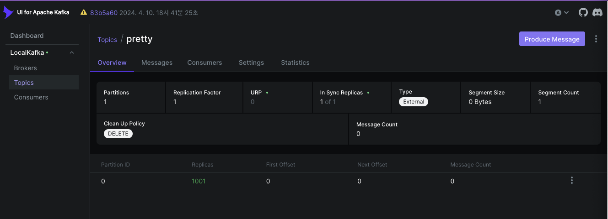

### **STEP 17_기본: Kafka 설치 및 연동**

#### 목표:
1. Docker로 Kafka 설치 및 실행.
2. ConcertReservationService 애플리케이션에 Kafka Producer/Consumer를 연동하여 테스트.
3. 완전한 기본 동작 확인.

---

## **1. Kafka 설치 및 실행**

### **docker-compose.yml**
Kafka와 Zookeeper, 그리고 Kafka UI를 포함한 Docker Compose 파일을 준비.

```yaml
version: '3.9'

services:
  zookeeper:
    image: bitnami/zookeeper:latest
    container_name: zookeeper
    environment:
      ALLOW_ANONYMOUS_LOGIN: "yes"
    ports:
      - "2181:2181"

  kafka:
    image: bitnami/kafka:latest
    container_name: kafka
    environment:
      KAFKA_CFG_ZOOKEEPER_CONNECT: zookeeper:2181
      KAFKA_CFG_LISTENERS: PLAINTEXT://:9092,EXTERNAL://0.0.0.0:29092
      KAFKA_CFG_ADVERTISED_LISTENERS: PLAINTEXT://kafka:9092,EXTERNAL://localhost:29092
      KAFKA_CFG_LISTENER_SECURITY_PROTOCOL_MAP: PLAINTEXT:PLAINTEXT,EXTERNAL:PLAINTEXT
      KAFKA_CFG_AUTO_CREATE_TOPICS_ENABLE: "true"
      ALLOW_PLAINTEXT_LISTENER: "yes"
    depends_on:
      - zookeeper
    ports:
      - "29092:29092"

  kafka-ui:
    image: provectuslabs/kafka-ui:latest
    container_name: kafka-ui
    environment:
      KAFKA_CLUSTERS_0_NAME: LocalKafka
      KAFKA_CLUSTERS_0_BOOTSTRAPSERVERS: kafka:9092
      KAFKA_CLUSTERS_0_ZOOKEEPER: zookeeper:2181
      KAFKA_CLUSTERS_0_PROPERTIES_SECURITY_PROTOCOL: PLAINTEXT
    depends_on:
      - kafka
    ports:
      - "9090:8080"
```

### **실행**
1. **Docker Compose로 컨테이너 실행:**
   ```bash
    ConcertReservationService on  feature/kafka-test-container [!+] is 📦 0.0.1-SNAPSHOT via ☕ v19.0.2 
    ➜ docker-compose -f docker/docker-compose.yml up -d
    [+] Running 4/4
    ✔ kafka 1 layers [⣿]      0B/0B      Pulled                                                                                                                                                                                                        87.1s
    ✔ 17fbc39829db Pull complete                                                                                                                                                                                                                     62.8s
    ✔ zookeeper 1 layers [⣿]      0B/0B      Pulled                                                                                                                                                                                                    88.9s
    ✔ 79d67ebeafc9 Pull complete                                                                                                                                                                                                                     66.6s
    [+] Running 4/4
    ✔ Network docker_default  Created                                                                                                                                                                                                                   0.1s
    ✔ Container zookeeper     Started                                                                                                                                                                                                                   0.7s
    ✔ Container kafka         Started                                                                                                                                                                                                                   0.1s
    ✔ Container kafka-ui      Started
   ```

2. **확인:**
    - Kafka 브로커가 `localhost:29092`에서 실행 중인지 확인.
        - 그걸 위해서 ?!?!?!
         
            ### **1.1 Kafka 컨테이너에 접속**
            먼저 Kafka 컨테이너 내부로 들어갑니다:
            ```bash
            ConcertReservationService on  feature/kafka-test-container [!+] is 📦 0.0.1-SNAPSHOT via ☕ v19.0.2 took 1m 31.3s 
            ➜ docker exec -it kafka /bin/bash
            I have no name!@a5fb5c0e9fd9:/$ id -u
            1001
            
            ```
            ### **1.2 컨테이너 내부 사용자 이름 변경**
             - 근데 이름이 없다고 하니..여기서 제가 컨테이너 내부 쉘 사용자에게 특별한 이름을 지어주면 더 친근하게 느껴질 거예요! 🐧
                
             ```bash
                    ConcertReservationService on  feature/kafka-test-container [!+] is 📦 0.0.1-SNAPSHOT via ☕ v19.0.2 took 23.7s
                    ➜ docker exec -u root -it kafka /bin/bash
                
                    root@a5fb5c0e9fd9:/# echo "pretty:x:1001:1001:Pretty:/home:/bin/bash" >> /etc/passwd
                    root@a5fb5c0e9fd9:/# exit
                    exit
                
                    ConcertReservationService on  feature/kafka-test-container [!+] is 📦 0.0.1-SNAPSHOT via ☕ v19.0.2 took 14.2s
                    ➜ docker exec -t kafka /bin/bash
                    pretty@a5fb5c0e9fd9:/$
            ```
            히히 이름 예쁜이로 지어주기 성공~!
                    
          ### **1.3 테스트용 토픽 생성**
        - `kafka-topics.sh` 명령어를 사용해 토픽을 생성 :
       
           ```bash
          kafka-topics.sh --create \
            --topic test-topic \
            --bootstrap-server localhost:29092 \
            --partitions 1 \
            --replication-factor 1
            ```
            옵션 설명
          - --create: 새로운 토픽을 생성.
          - --topic: 생성할 토픽의 이름. 예: test-topic.
          - --bootstrap-server: Kafka 브로커의 주소. 예: localhost:29092.
          - --partitions: 토픽의 파티션 개수. 기본적으로 1로 설정 가능. 
          - --replication-factor: 복제 계수. 단일 브로커 환경에서는 1로 설정.
       
          ### **1.4. 생성된 토픽 확인**
            생성된 토픽을 확인하려면 다음 명령어를 사용..하려고 했는데 ?!?!?:
            ```bash
          kafka-topics.sh --list --bootstrap-server localhost:29092
             ```
             ....는 cli로 생성 요청 및 확인 요청했더니
          ```bash
           ConcertReservationService on  feature/kafka-test-container [!+] via ☕ v19.0.2 took 11.3s …
            ➜ docker exec -t kafka /bin/bash
            pretty@a5fb5c0e9fd9:/$ kafka-topics.sh --create --topic pretty --bootstrap-server localhost:29092 --partitions 1 --replication-factor 1
                    
           ConcertReservationService on  feature/kafka-test-container [!+] via ☕ v19.0.2 …
            ➜ docker exec -t kafka /bin/bash                           
            pretty@a5fb5c0e9fd9:/$ kafka-topics.sh --list --bootstrap-server localhost:29092
          ```
          이렇게 가마니..있어서..그냥 ui로 생성하고 확인했다. 어쨌든 생성과 확인이 목적인거니까.
          

### **Kafka UI 확인**

  - Kafka UI는 [http://localhost:9090](http://localhost:9090)에서 접속 가능.

---

## **2. Spring Boot에서 Kafka 연동**

### **프로젝트 초기 설정**
1. **Gradle 의존성 추가:**
   ```gradle
   implementation 'org.springframework.kafka:spring-kafka'
   ```

2. **application.yml:**
   ```yaml
   spring:
     kafka:
       bootstrap-servers: localhost:29092
       consumer:
         group-id: test-pretty
         auto-offset-reset: earliest
       producer:
         key-serializer: org.apache.kafka.common.serialization.StringSerializer
         value-serializer: org.apache.kafka.common.serialization.StringSerializer
   ```
---

### **코드 구현**

#### **1. Producer (메시지 전송)**
```kotlin
import org.springframework.kafka.core.KafkaTemplate
import org.springframework.stereotype.Service

@Service
class KafkaProducerService(
    private val kafkaTemplate: KafkaTemplate<String, String>
) {
    fun sendMessage(topic: String, message: String) {
        kafkaTemplate.send(topic, message)
    }
}
```

---

#### **2. Consumer (메시지 수신)**
```kotlin
import org.springframework.kafka.annotation.KafkaListener
import org.springframework.stereotype.Service

@Service
class KafkaConsumerService {
    @KafkaListener(topics = ["pretty"], groupId = "test-pretty")
    fun consumeMessage(message: String) {
        println("Received message: $message")
    }
}
```

---

### **설명**
1. **Producer**:
    - `KafkaTemplate`은 메시지를 Kafka로 전송하는 데 사용됩니다.
    - `sendMessage` 함수는 지정된 토픽에 메시지를 보냅니다.

2. **Consumer**:
    - `@KafkaListener` 어노테이션을 사용해 특정 토픽(`pretty`)에서 메시지를 수신합니다.
    - 메시지는 `println`으로 출력됩니다.

---

3. **테스트 실행:**
    - Producer를 통해 메시지 전송.
    - Consumer가 메시지를 수신하고 출력.

---


## **3. 테스트 확인**


### **1. 메시지 전송**
- **Spring Boot**: `KafkaProducerService`를 호출하여 메시지 전송.

### **2. 메시지 수신**
- **Spring Boot**: `KafkaConsumerService`에서 메시지를 수신.

### **3. Kafka UI 확인**
- Kafka UI에서 토픽 및 메시지 상태를 확인.

---

## **4. 정리**

1. Docker Compose를 사용해 Kafka 환경 구성.
2. Spring Boot에서 각각 Kafka Producer와 Consumer 구현.
3. Kafka UI 및 CLI를 통해 Kafka 상태 확인.
4. 애플리케이션에서 메시지 송수신 테스트 완료.

헤헤 뿌듯핑 😊